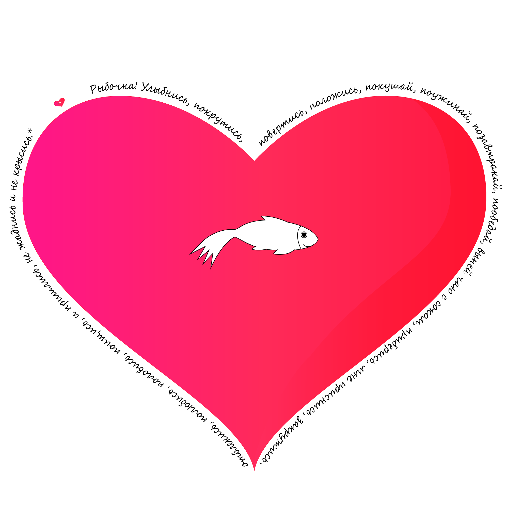

[Блог](https://XPIOKBA.github.io/blog/) <right>[Test 🥒](/github-slideshow)</right>
# <center>XPIOKBA ЛЮБИТ РЫБКУ</center>

<p><center>...(и раков).</center>
</p><br>
`Рыбный код:` 
 ```javascript
if (GiveMeFish)
then {
  GetCancers = true
}
```
